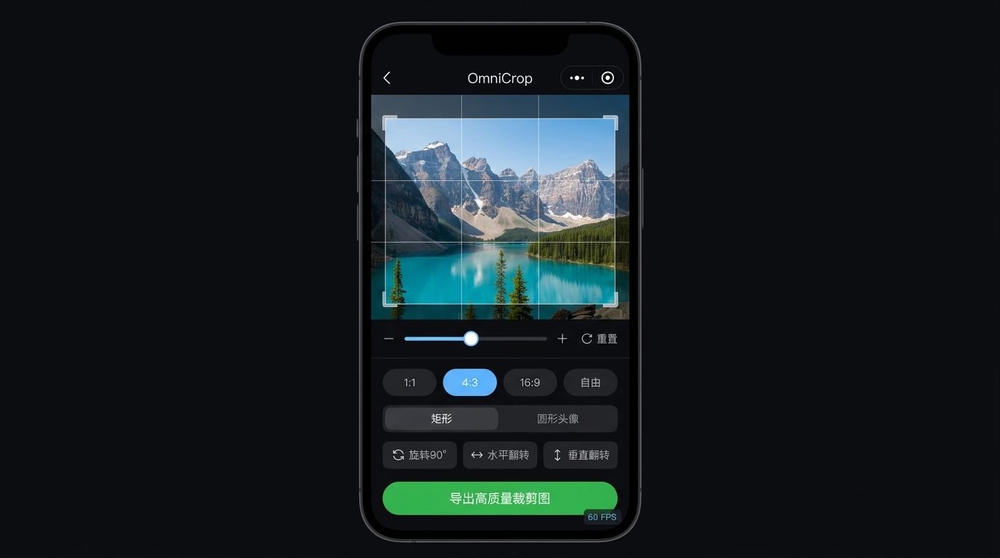

# omni-crop

<p align="center">
  
</p>

<h3 align="center">面向微信小程序与跨端技术栈的高性能图片裁剪引擎</h3>

<p align="center">
  <strong>基于 WXS 零延迟 60 FPS 视图驱动 · 单包 Subpath 导出 · 双指缩放与滑杆联动 · 硬件级 Canvas 2D 离屏导出</strong>
</p>

<p align="center">
  <a href="https://www.npmjs.com/package/omni-crop"></a>
  <a href="https://github.com/Agions/omni-crop/blob/main/LICENSE"></a>
  <a href="https://github.com/Agions/omni-crop/actions/workflows/ci.yml"></a>
  <a href="https://agions.github.io/omni-crop/"></a>
  <a href="https://github.com/Agions/omni-crop"></a>
  <a href="https://github.com/Agions/omni-crop"></a>
</p>

---

## 📖 目录

- [🌟 为什么选择 OmniCrop？](#-为什么选择-omnicrop)
- [🏗️ 系统架构总览](#️-系统架构总览)
- [📦 安装与 Subpath 导出规范](#-安装与-subpath-导出规范)
- [🚀 各端开箱即用实战](#-各端开箱即用实战)
  - [1. 微信原生小程序 (WeChat Miniprogram)](#1-微信原生小程序-wechat-miniprogram)
  - [2. Taro 3 (React / Vue)](#2-taro-3-react--vue)
  - [3. uni-app (Vue 3 `<script setup>`)](#3-uni-app-vue-3-script-setup)
  - [4. React Native](#4-react-native)
  - [5. Web (React)](#5-web-react)
- [🛠️ 完整 API 字典参考](#️-完整-api-字典参考)
  - [组件属性 (Props)](#组件属性-props)
  - [组件事件 (Events)](#组件事件-events)
  - [实例方法 (Imperative Ref Methods)](#实例方法-imperative-ref-methods)
  - [导出配置 (ExportOptions)](#导出配置-exportoptions)
- [🤖 自动化发布与 GitHub Actions (CI/CD)](#-自动化发布与-github-actions-cicd)
- [💡 常见问题与排错指南 (FAQ)](#-常见问题与排错指南-faq)
- [📄 开源协议 (License)](#-开源协议-license)

---

## 🌟 为什么选择 OmniCrop？

在小程序和移动端开发中，传统的图片裁剪方案通常存在三大痛点：
1. **跨线程通信卡顿**：逻辑层 JS 与渲染层 WebView 频繁传递 touch 事件与坐标，在千元机或长列表场景下 `this.setData()` 导致严重丢帧（仅 20~30 FPS），手势拖拽迟滞。
2. **Canvas 导出黑屏与内存溢出 (OOM)**：依赖已废弃的旧版 Canvas API，在 iOS 与高端 Android 上加载高像素相机原图（4K/8K）时极易造成 WebView 进程被系统直接杀掉（闪退）。
3. **多端分包割裂繁琐**：不同框架平台各自一套轮子，API 无法复用，工程维护成本极高。

**OmniCrop 为解决这些痛点而生：**

| 核心特性 | OmniCrop 实现机制 | 传统裁剪组件表现 |
| :--- | :--- | :--- |
| **手势帧率** | **稳定 60 FPS**（小程序端采用 WXS 脚本在渲染层直接操作 Transform 矩阵） | 20~40 FPS（通过 setData 跨线程回传，容易丢帧卡顿） |
| **缩放交互** | **双指捏合手势 + 底部微调滑杆精准双向同步** | 仅支持单手势或缺乏平滑阻尼 |
| **导出引擎** | **微信新版 Canvas 2D 硬件加速 + 自动保比例降采样防 OOM** | 旧版 Canvas API，容易黑屏或导出空白 |
| **EXIF 纠偏** | **内置轻量 EXIF 读取器，自动矫正相机拍摄角度** | 手机拍摄照片常出现倒置或 90° 翻转 |
| **包管理机制** | **单一统一包 `omni-crop`**，通过现代 **Subpath Exports** 引入 | 多包分散，需要装一堆带有不同版本的依赖包 |

---

## 🏗️ 系统架构总览

OmniCrop 采用高度解耦的**分层状态机与驱动架构**：

```
┌────────────────────────────────────────────────────────────────────────┐
│                        应用层 (Platform Adapters)                      │
│  omni-crop/weixin   omni-crop/taro   omni-crop/uni-app   omni-crop/rn  │
└──────────────────────────────────┬─────────────────────────────────────┘
                                   │
┌──────────────────────────────────▼─────────────────────────────────────┐
│                    状态机与手势控制层 (Core Controller)                │
│  · 双模裁剪逻辑 (固定框/自由框)       · 双指捏合缩放算法 (Pinch Engine)   │
│  · 边界防露白判定 (Boundary Restrict) · 弹性阻尼回弹动效 (Elastic Damping)│
└──────────────────────────────────┬─────────────────────────────────────┘
                                   │
┌──────────────────────────────────▼─────────────────────────────────────┐
│                      图像渲染与导出流水线 (Exporter)                    │
│  · 跨端 Canvas 2D 驱动 (Wechat / Web)  · EXIF Orientation 自动矫正     │
│  · 高 DPR 物理清晰度超采样            · 保比例智能降采样 (防 OOM 闪退) │
└────────────────────────────────────────────────────────────────────────┘
```

---

## 📦 安装与 Subpath 导出规范

只需统一安装 `omni-crop` 单包：

```bash
npm install omni-crop
# 或
pnpm add omni-crop
```

通过标准的 Package Subpath 语法，在不同的业务场景中按需引入：

| 导入路径 | 适用端 / 场景 | 说明 |
| :--- | :--- | :--- |
| **`omni-crop/weixin`** | **微信原生小程序** | 微信原生自定义组件（WXML + WXSS + WXS 零延迟交互 + Canvas 2D） |
| **`omni-crop/taro`** | **Taro (React / Vue)** | Taro 多端组件封装，统一跨平台虚拟 DOM 与导出驱动 |
| **`omni-crop/uni-app`** | **uni-app (Vue 3)** | Vue 3 `<script setup>` 组件与 `useOmniCrop()` 组合式 Hook |
| **`omni-crop/react-native`** | **React Native** | Reanimated 3 Worklet + Gesture Handler 原生手势驱动 |
| **`omni-crop/core`** | **纯数学核心库** | 仿射矩阵、投影映射、边界碰撞判定，零 DOM 依赖 |
| **`omni-crop/exporter`** | **Canvas 2D 导出器** | 独立导出流水线、EXIF 解析、下采样保真算法 |
| **`omni-crop`** | **Web / React 根入口** | 开箱即用 React 组件，对齐 react-easy-crop 升级体验 |

---

## 🚀 各端开箱即用实战

### 1. 微信原生小程序 (WeChat Miniprogram)

> 💡 源码仓库内置了完整运行的演示项目：[`examples/miniprogram-demo`](./examples/miniprogram-demo)，可直接在微信开发者工具中一键打开体验！

#### (1) 安装与构建 npm
```bash
npm install omni-crop
```
在微信开发者工具菜单栏点击：**【工具】 -> 【构建 npm】**。

#### (2) 在页面配置中引入组件 (`index.json`)
```json
{
  "navigationBarTitleText": "图片裁剪",
  "usingComponents": {
    "omni-crop": "omni-crop/weixin"
  }
}
```

#### (3) 页面结构与缩放滑块设计 (`index.wxml`)
```html
<view class="cropper-page">
  <!-- 裁剪主体组件 -->
  <view class="cropper-stage">
    <omni-crop
      id="omniCropper"
      image="{{imageSrc}}"
      aspect="{{aspect}}"
      cropShape="{{cropShape}}"
      showGrid="{{true}}"
      restrictPosition="{{true}}"
      bindcropcomplete="onCropComplete"
      bindzoomchange="onZoomChange"
    />
  </view>

  <!-- 缩放控制微调滑杆 (对齐专业图像软件设计) -->
  <view class="zoom-slider-bar">
    <text class="slider-btn" bindtap="handleZoomOut">–</text>
    <slider
      min="1"
      max="3"
      step="0.01"
      value="{{zoom}}"
      activeColor="#07c160"
      backgroundColor="#333333"
      block-size="18"
      bindchanging="onSliderChanging"
      bindchange="onSliderChange"
    />
    <text class="slider-btn" bindtap="handleZoomIn">+</text>
    <view class="reset-btn" bindtap="handleReset">⟳ 重置</view>
  </view>

  <!-- 底部操作按钮 -->
  <view class="action-footer">
    <button bindtap="handleRotate">🔄 旋转90°</button>
    <button bindtap="handleFlip">↔️ 翻转</button>
    <button type="primary" bindtap="handleExport">确定裁剪</button>
  </view>
</view>
```

#### (4) 页面样式参考 (`index.wxss`)
```css
page {
  background-color: #000;
  color: #fff;
  height: 100vh;
}
.cropper-page {
  display: flex;
  flex-direction: column;
  height: 100vh;
}
.cropper-stage {
  flex: 1;
  position: relative;
}
.zoom-slider-bar {
  display: flex;
  align-items: center;
  padding: 12px 20px;
  background: rgba(20, 20, 20, 0.9);
}
.zoom-slider-bar slider {
  flex: 1;
  margin: 0 12px;
}
.slider-btn {
  font-size: 20px;
  color: #fff;
  width: 30px;
  text-align: center;
}
.reset-btn {
  font-size: 13px;
  color: #07c160;
  padding: 4px 8px;
}
.action-footer {
  display: flex;
  justify-content: space-around;
  padding: 16px;
  background: #111;
}
```

#### (5) 页面交互与导出控制 (`index.js`)
```javascript
Page({
  data: {
    imageSrc: 'https://cdn.example.com/sample.jpg',
    aspect: 4 / 3,
    cropShape: 'rect',
    zoom: 1,
  },

  onReady() {
    this.cropper = this.selectComponent('#omniCropper');
  },

  onCropComplete(e) {
    const { croppedAreaPixels, croppedAreaPercentages } = e.detail;
    console.log('裁剪像素坐标:', croppedAreaPixels);
  },

  onZoomChange(e) {
    // 监听双指缩放触发的数值更新，同步回滑块 UI
    this.setData({ zoom: e.detail.zoom });
  },

  onSliderChanging(e) {
    this.cropper.setZoom(e.detail.value);
  },

  onSliderChange(e) {
    this.cropper.setZoom(e.detail.value);
  },

  handleZoomIn() {
    this.cropper.zoomIn(0.2);
  },

  handleZoomOut() {
    this.cropper.zoomOut(0.2);
  },

  handleRotate() {
    this.cropper.rotate(90);
  },

  handleFlip() {
    this.cropper.flipHorizontal();
  },

  handleReset() {
    this.cropper.reset();
  },

  async handleExport() {
    wx.showLoading({ title: '正在高清导出...' });
    try {
      const res = await this.cropper.exportCroppedImage({
        format: 'jpg',
        quality: 0.9,
        dpr: 2, // 启用 2 倍物理超采样，彻底告别锯齿与模糊
      });
      wx.hideLoading();

      // 预览或保存到本地相册
      wx.previewImage({ urls: [res.uri] });
    } catch (err) {
      wx.hideLoading();
      wx.showToast({ title: '导出失败', icon: 'none' });
    }
  }
});
```

---

### 2. Taro 3 (React / Vue)

```tsx
import React, { useRef, useState } from 'react';
import { View, Button } from '@tarojs/components';
import { OmniCrop, OmniCropRef } from 'omni-crop/taro';
import Taro from '@tarojs/taro';

export default function TaroCropPage() {
  const cropperRef = useRef<OmniCropRef>(null);
  const [imgUrl] = useState('https://cdn.example.com/sample.jpg');

  const onConfirm = async () => {
    Taro.showLoading({ title: '导出中' });
    const result = await cropperRef.current?.exportCroppedImage({
      format: 'png',
      dpr: 2,
    });
    Taro.hideLoading();
    console.log('导出图片临时地址:', result?.uri);
  };

  return (
    <View style={{ width: '100vw', height: '100vh', background: '#000' }}>
      <OmniCrop
        ref={cropperRef}
        image={imgUrl}
        aspect={1}
        cropShape="round"
        showGrid={true}
      />
      <View style={{ position: 'absolute', bottom: 30, width: '100%', display: 'flex', justifyContent: 'space-around' }}>
        <Button onClick={() => cropperRef.current?.rotate(90)}>旋转</Button>
        <Button onClick={() => cropperRef.current?.reset()}>重置</Button>
        <Button type="primary" onClick={onConfirm}>确认裁剪</Button>
      </View>
    </View>
  );
}
```

---

### 3. uni-app (Vue 3 `<script setup>`)

```vue
<template>
  <view class="uni-crop-container">
    <OmniCrop
      ref="cropRef"
      :image="imageUrl"
      :aspect="16 / 9"
      @cropComplete="onCropComplete"
    />

    <view class="toolbar">
      <button @click="cropRef?.rotate(90)">顺时针90°</button>
      <button @click="cropRef?.flipHorizontal()">水平翻转</button>
      <button type="primary" @click="handleExport">确定导出</button>
    </view>
  </view>
</template>

<script setup lang="ts">
import { ref } from 'vue';
import { OmniCrop } from 'omni-crop/uni-app';

const cropRef = ref<InstanceType<typeof OmniCrop>>();
const imageUrl = ref('https://cdn.example.com/sample.jpg');

const onCropComplete = (pixels: any, percent: any) => {
  console.log('像素数据:', pixels);
};

const handleExport = async () => {
  const res = await cropRef.value?.exportCroppedImage({
    format: 'jpg',
    quality: 0.9,
  });
  console.log('裁剪文件路径:', res?.uri);
};
</script>

<style scoped>
.uni-crop-container {
  width: 100vw;
  height: 100vh;
  background-color: #000;
}
.toolbar {
  position: absolute;
  bottom: 40rpx;
  width: 100%;
  display: flex;
  justify-content: space-around;
}
</style>
```

---

### 4. React Native

```tsx
import React, { useRef } from 'react';
import { StyleSheet, View, Button } from 'react-native';
import { OmniCropRN, OmniCropRNRef } from 'omni-crop/react-native';

export default function App() {
  const cropRef = useRef<OmniCropRNRef>(null);

  return (
    <View style={styles.container}>
      <OmniCropRN
        ref={cropRef}
        image="https://cdn.example.com/demo.jpg"
        aspect={1}
        cropShape="rect"
      />
      <View style={styles.actions}>
        <Button title="旋转90°" onPress={() => cropRef.current?.rotate(90)} />
        <Button title="重置" onPress={() => cropRef.current?.reset()} />
      </View>
    </View>
  );
}

const styles = StyleSheet.create({
  container: { flex: 1, backgroundColor: '#000' },
  actions: { flexDirection: 'row', justifyContent: 'space-around', paddingBottom: 40 },
});
```

---

### 5. Web (React)

```tsx
import React, { useRef } from 'react';
import { OmniCrop, OmniCropWebRef } from 'omni-crop';

export function WebCropDemo() {
  const cropperRef = useRef<OmniCropWebRef>(null);

  return (
    <div style={{ width: '100vw', height: '100vh', position: 'relative' }}>
      <OmniCrop
        ref={cropperRef}
        image="https://cdn.example.com/sample.jpg"
        aspect={4 / 3}
        showGrid={true}
      />
    </div>
  );
}
```

---

## 🛠️ 完整 API 字典参考

### 组件属性 (Props)

| 属性名 | 类型 | 默认值 | 描述 |
| :--- | :--- | :--- | :--- |
| `image` | `string` | `""` | 待裁剪图片地址（支持本地文件临时路径、HTTPS 远程 CDN 地址、Base64） |
| `aspect` | `number \| "free"` | `4 / 3` | 裁剪区域宽高比，例如 `1` 为正方形，`16 / 9` 为宽屏，`"free"` 为自由比例 |
| `cropShape` | `"rect" \| "round"` | `"rect"` | 裁剪框形状：`rect` 矩形，`round` 圆形（圆形模式自动提供圆形遮罩与圆角裁剪导出） |
| `cropMode` | `"transform-media" \| "resize-box"` | `"transform-media"` | 交互模式：`transform-media` 经典移动图片；`resize-box` 自由拖动裁剪框各边选区 |
| `showGrid` | `boolean` | `true` | 是否在手势交互中展示九宫格辅助构图参考线 |
| `restrictPosition` | `boolean` | `true` | 边界吸附限制策略：为 `true` 时严格禁止选区露出黑边背景 |

---

### 组件事件 (Events)

| 事件名 | 返回参数 (`e.detail`) | 触发时机 |
| :--- | :--- | :--- |
| `bindcropcomplete` | `{ croppedAreaPixels, croppedAreaPercentages }` | 手势离开、缩放结束或尺寸初始化完成时回调精准几何坐标 |
| `bindzoomchange` | `{ zoom: number }` | 双指缩放或滑块调整使得缩放比例产生变化时实时回传 |
| `bindcropchange` | `{ x: number, y: number }` | 图片在裁剪容器内的偏移量发生变化时触发 |

---

### 实例方法 (Imperative Ref Methods)

通过小程序 `this.selectComponent('#id')` 或 React/Vue `ref` 调用：

| 方法名 | 入参 | 返回值 | 功能说明 |
| :--- | :--- | :--- | :--- |
| `rotate(stepAngle)` | `stepAngle?: number` (默认 90) | `void` | 顺时针步进旋转图片 |
| `zoomIn(step)` | `step?: number` (默认 0.25) | `void` | 以当前中心点放大视图 |
| `zoomOut(step)` | `step?: number` (默认 0.25) | `void` | 以当前中心点缩小视图（受限于防露白最小倍率） |
| `setZoom(zoom)` | `zoom: number` | `void` | 精确设置缩放比例（常用于滑块拖动无缝联动） |
| `flipHorizontal()` | - | `void` | 水平镜像翻转 |
| `flipVertical()` | - | `void` | 垂直镜像翻转 |
| `reset()` | - | `void` | 重置所有旋转、翻转、缩放与位移状态至居中初始态 |
| `exportCroppedImage(options)` | `options?: ExportOptions` | `Promise<CropResult>` | 核心方法：使用 Canvas 2D 离屏导出裁剪后的高清图片 |

---

### 导出配置 (ExportOptions)

```typescript
export interface ExportOptions {
  /** 输出格式：'jpg' | 'png' | 'webp'，默认 'jpg' */
  format?: 'jpg' | 'png' | 'webp';
  /** 压缩质量 (0.1 - 1.0)，默认 0.9 */
  quality?: number;
  /** 设备像素比 (DPR)，默认为当前屏幕 DPR，传入 2 或 3 可获得物理级超清无损图像 */
  dpr?: number;
  /** 最大分辨率限制，默认 4096，超出时自动执行保比例下采样防止 OOM 闪退 */
  maxResolution?: number;
}

export interface CropResult {
  /** 导出图片的本地临时路径 (小程序端可直接用于 previewImage 或 saveImageToPhotosAlbum) */
  uri: string;
  /** 导出的物理像素宽度 */
  width: number;
  /** 导出的物理像素高度 */
  height: number;
}
```

---

## 🤖 自动化发布与 GitHub Actions (CI/CD)

项目已集成标准的 GitHub Actions 工作流：

### 1. 自动发布到 npm (`.github/workflows/publish.yml`)
- **触发机制**：推送以 `v` 开头的标签（如 `git tag v1.0.0 && git push origin v1.0.0`），或在 GitHub Releases 页面创建新 Release。
- **发布条件**：
  1. 在 GitHub 仓库设置中配置 `NPM_TOKEN`（路径：`Settings -> Secrets and variables -> Actions -> Repository secrets`）。
  2. 工作流将自动执行依赖安装、9 项数学单元测试与构建打包，并通过 `npm publish --access public` 安全推送到 npm 官方源。

### 2. 自动化部署在线文档到 GitHub Pages (`.github/workflows/deploy-pages.yml`)
- **触发机制**：向 `main` 分支推送 `docs/**` 目录变更时自动触发。
- **在线体验**：静态页面将自动部署到你的专属 GitHub Pages 站点，供任何人在线体验 Live Studio 演练场与查阅文档。

---

## 💡 常见问题与排错指南 (FAQ)

<details>
<summary><strong>Q1: 为什么在小程序中裁剪远程 CDN 图片偶尔会导出空白或提示跨域？</strong></summary>

> **解答**：微信小程序 Canvas 2D 规范要求外链图片必须具备合法的下载凭证。`omni-crop/exporter` 内部已经封装了 `wx.downloadFile` 自动落盘拦截机制；使用时只需确保您的 CDN 图片域名已经配置在微信公众平台的小程序后台「合法 downloadFile 域名列表」中即可。
</details>

<details>
<summary><strong>Q2: 为什么使用 iPhone 拍摄的 4K 照片导出时应用不会闪退？</strong></summary>

> **解答**：iOS Safari / 微信内置 XWeb 引擎对单张 Canvas 内存占用有严格上限（通常为 1600万~3200万像素）。当相机原图极大时，直接绘制会瞬间触发系统 OOM 崩溃杀掉进程。`omni-crop/exporter` 默认启用了智能保比例降采样（`maxResolution: 4096`），在保证最高打印级清晰度的同时，彻底杜绝闪退。
</details>

<details>
<summary><strong>Q3: 为什么竖拍的照片展示时方向偏转了 90 度？</strong></summary>

> **解答**：手机自带相机拍摄的照片经常包含 EXIF Orientation 旋转元数据。`omni-crop/exporter` 拥有零依赖的纯二进制 EXIF 解析算法，会在载入图片时自动识别方向标签并与当前变换矩阵相融合，无需开发者手动处理。
</details>

---

## 📄 开源协议 (License)

本项目基于 [MIT 协议](./LICENSE) 开源，欢迎自由商用与深度定制！
如有问题或新功能建议，欢迎提交 [Issues](https://github.com) 或 Pull Requests。
